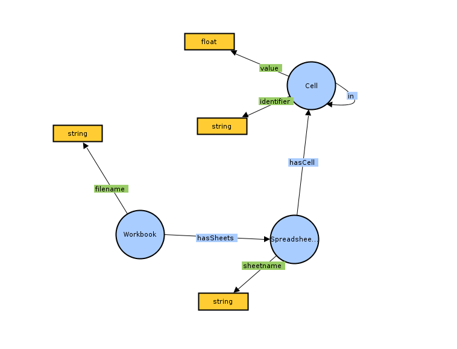
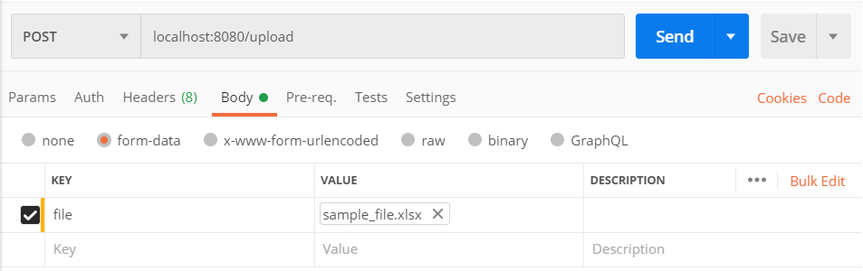

# Auditable environmental research

This project was creates as part of Data Stewardship course at Vienna University of Technology in summer semester of 2020.

## Introduction

Aim of the project is to help track how the final result in a certain excel spreadsheet's cells is produced.
It should help engineers to capture dependencies between different cells and columns, by transforming parts od the excel spreadsheets into knowledge graphs.
Since the knowledge graphs are stored in a knowledge graph store there is a possibility to query the data using simple SparQL queries. 
These queries can be conducted to represent for example certain constraints like listing out cells that have certain value, or value higher than desired.

## Tools used

* Apache POI (java) for excel processing
* Protege for Ontology/Data model building
* Apache Jena (java) for Knowledge Graph manipulation
* Apache Jena TDB for Knowledge Graph storage and query

## Steps perfomed in the project

1. A simple ontology (Knowledge Graph data model) is developed to describe components of an excel
   file and its components, e.g., Sheet, Row, Columns, Cells, etc.
2. An excel library (Apache POI) is used to extract necessary information to populate the
   Knowledge Graph from an excel file.
3. The extracted information is transformed into a Knowledge Graph according to the simple ontology
   (using Apache Jena). 
4. The Knowledge Graph is stored in a Knowledge Graph Store (Apache Jena TDB)
5. Queries are developed to show:
    * dependencies between cells
    * check if cells have a certain value
 
 ## Ontology graph
 
 
 
 ## Prerequisites
 
 Prerequisites for running the project are:
  * Java 8 or higher
  * Maven
  
 ## Running the project
 
 1. Download the sources from [GitHub](https://github.com/aleksandarsibincic/ExcelAudit) 
 2. a. Compile application using
  ``mvn clean install``  
    b. Simply start the application using IDE which supports java applications and skip step 3
 3. jar file is generated in target/ folder and can be executed with the command:
   ``java -jar [executable-name].jar``
 
## How to use the application

1. Start the application
2. Upload xlsx file, you want to process, via post method http://localhost:8080/upload in which required parameter "file" is mandatory  
    * There is sample_file.xslx inside the application folder which can be used for testing  
    * In this example Postman REST client is used

3. If a request is being processed switch to the application output and check if it is ready
4. Choose an option a, b or c in the command line  
   a - Find dependent cells  
   b - Find cells with certain value  
   c - Upload a new file
   1. Option a - you will be asked to provide a cell number for which you want to find out, which cells depend on it
   2. Option b - you will be asked to provide a value in order to check which (intermediate) cells contain that value.  
   This step may be modified by changing the query for certain constraint you want to check the cells to.
   3. Option c - you will jump to the step 2
 
## Contributors

* [Mensur Besirovic](https://orcid.org/0000-0001-7084-3423)
* [Aleksandar Sibincic](https://orcid.org/0000-0002-4844-6306)

## License

[MIT](LICENSE)

